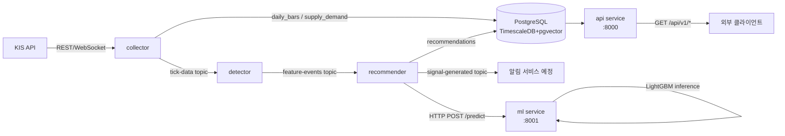

# 아키텍처

---

## 디렉토리 구조

```
kospi-feature-stock/
├── services/
│   ├── collector/          # KIS REST/WebSocket — 실시간 체결·일봉·지수·수급 수집
│   ├── detector/           # Kafka 소비 — 캔들스틱 패턴 탐지, feature_events 발행
│   ├── recommender/        # ML 기반 BUY/WAIT/SKIP 판단, signal-generated 발행
│   ├── ml/                 # FastAPI ML 추론 서비스 (port 8001)
│   └── api/                # FastAPI REST API 서비스 (port 8000)
├── infra/
│   └── postgres/           # DB 마이그레이션 SQL (V1__ ~ V3__ 순서대로 적용)
├── scripts/
│   ├── train_model.py      # LightGBM 수동 재학습
│   ├── backtest_run.py     # 백테스트 (--mode events|replay)
│   └── backfill_vectors.py # pattern_vector 일괄 백필
├── tests/                  # pytest 단위 테스트 (27개)
├── docker-compose.yml
└── .env.example
```

---

## 컴포넌트 다이어그램



---

## 데이터 흐름

### 실시간 신호 생성 흐름
```
KIS WebSocket → collector._tick_loop()
  → Kafka: tick-data
  → detector._detect() (VOLUME_SURGE / BREAKOUT_52W / MORNING_STAR 등)
  → Kafka: feature-events
  → recommender._emit()
      → ml service POST /predict (HTTP, fallback: local LightGBM → rule-based)
      → action = BUY | WAIT | SKIP
      → PostgreSQL: recommendations 저장
      → Kafka: signal-generated (BUY 시만 발행)
```

### 일봉 수집 흐름 (장 마감 후)
```
collector._daily_bar_loop()
  → KIS REST: 종목 일봉 (1,133개+)
  → PostgreSQL: daily_bars (TimescaleDB hypertable)
  → KOSPI(0001) / KOSDAQ(1001) 지수 일봉 추가 수집
  → _daily_bars_done 이벤트 발행
  → collector._supply_demand_eod_loop()
      → KIS REST: 전체 종목 수급 (3,967개)
      → PostgreSQL: supply_demand
```

### ML 재학습 흐름
```
ml service._weekly_retrain_loop() (매주 일요일 02:00 KST)
  → train_entry() + train_risk()
  → IsotonicRegression 캘리브레이터 피팅
  → tmp/ 경로 저장 → atomic rename (핫스왑)
  → POST /reload 자동 호출
```

### 스타트업 Recovery 흐름
```
recommender 재시작 → _recover_missed_events()
  → feature_events.feature_event_id 기준 NOT EXISTS 조건
  → 미처리 이벤트만 재처리 (중복 0건 보장)
```

---

## 서비스별 책임

| 서비스 | 책임 | 하지 말아야 할 것 |
|--------|------|----------------|
| collector | KIS API 호출, DB 저장, Kafka 발행 | 패턴 판단, 추천 로직 |
| detector | Kafka 소비, 패턴 탐지, feature_events 발행 | DB 직접 쿼리(feature_events 외), ML 호출 |
| recommender | ML 추론 요청, BUY 판단, signal 발행 | 직접 KIS API 호출, ML 모델 학습 |
| ml | 모델 로드/추론, 주간 재학습 | 외부 Kafka 소비 |
| api | 조회 REST API 제공 | 비즈니스 로직, Kafka 발행 |

---

## 외부 의존성

| 시스템 | 용도 | 필수 | fallback |
|--------|------|------|---------|
| KIS OpenAPI | 실시간 체결·일봉·수급 수집 | 필수 | 없음 (데이터 소스) |
| PostgreSQL 16 + TimescaleDB + pgvector | 시계열·벡터 저장 | 필수 | 없음 |
| Kafka | 서비스간 비동기 메시지 | 필수 | 없음 |
| Redis | 캐시·Pub-Sub (예정) | 선택 | 미사용 시 skip |
| ML service (port 8001) | LightGBM 추론 | 선택 | local LightGBM → rule-based fallback |

---

## ML 모델 현황

| 모델 | AUC | 학습 데이터 | 주요 피처 |
|------|-----|------------|---------|
| entry_model.lgb | 0.7546 | 278,088행, 2,783종목 (2025-09-18~2026-06-05) | macd_hist, atr_ratio, rsi14, ma60_ratio, lower_wick |
| risk_model.lgb | 0.7800 | 동일 | 동일 피처 43개 |
| entry_calibrator.pkl | — | Isotonic Regression | raw 확률 → 보정 확률 |
| risk_calibrator.pkl | — | Isotonic Regression | raw 확률 → 보정 확률 |

백테스트 결과 (2025-09-18 ~ 2026-04-30, stop=5%, target=10%, hold=10일):

| 신호 | 승률 | Profit Factor | Sharpe |
|------|------|---------------|--------|
| BREAKOUT_52W | 40.3% | 1.23 | 0.47 |
| VOLUME_SURGE (x5.0) | 35.7% | 1.06 | 0.13 |
