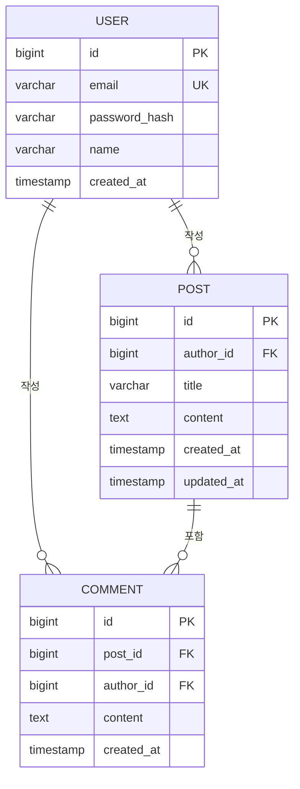

> 이 문서는 스켈레톤입니다. 본 프로젝트에 맞게 재작성하세요.
> 각 섹션의 `{...}` 플레이스홀더와 `<!-- 예시 -->` 마커가 달린 항목을 교체하세요.

# 데이터베이스 스키마

> AI 에이전트가 코드를 작성할 때 이 문서를 참조합니다.
> 엔티티 설계, 테이블 구조, 관계, 인덱스 전략을 여기에 기록하세요.
>
> **관리 방침**: 이 문서는 `/a2m_improve` 중에도 마이그레이션 파일(`V{n}__...sql`)과 **동시에** 직접 수정합니다.
> `PRD.md`, `ARCHITECTURE.md` 등 다른 docs와 달리, 이 문서는 항상 현재 DB 상태와 일치해야 합니다.

---

## DBMS

| 항목 | 내용 |
|------|------|
| DBMS | {예: PostgreSQL 16} |
| ORM | {예: JPA / Hibernate 6} |
| 마이그레이션 도구 | {예: Flyway 10 / Liquibase} |
| 파일 위치 | {예: `backend/src/main/resources/db/migration/`} |

---

## ER 다이어그램

> 이 섹션의 목적: 테이블 간 관계를 한눈에 파악할 수 있도록 한다.



위 예시를 지우고 실제 ER 다이어그램으로 교체하세요. <!-- 예시 -->

{실제 ER 다이어그램}

---

## 테이블 설계

> 이 섹션의 목적: 각 테이블의 컬럼, 타입, 제약조건을 명세한다.
> AI가 JPA 엔티티 코드를 작성할 때 이 정의를 기준으로 한다.

### {테이블명} <!-- 예시 -->

**예시 — `users` 테이블** <!-- 예시 -->

| 컬럼 | 타입 | NULL | 기본값 | 설명 |
|------|------|------|--------|------|
| `id` | `BIGINT` | NOT NULL | auto_increment | PK |
| `email` | `VARCHAR(255)` | NOT NULL | — | 로그인 이메일, UNIQUE |
| `password_hash` | `VARCHAR(255)` | NOT NULL | — | bcrypt 해시 |
| `name` | `VARCHAR(100)` | NOT NULL | — | 표시 이름 |
| `role` | `VARCHAR(20)` | NOT NULL | `'USER'` | ROLE_USER / ROLE_ADMIN |
| `created_at` | `TIMESTAMP` | NOT NULL | `now()` | 생성일시 |
| `updated_at` | `TIMESTAMP` | NOT NULL | `now()` | 수정일시 |

**JPA 엔티티 매핑 메모:** <!-- 예시 -->
- `role` 컬럼은 `@Enumerated(EnumType.STRING)` 사용
- `created_at`, `updated_at`은 `@CreationTimestamp`, `@UpdateTimestamp` 사용

---

### {테이블명 2}

| 컬럼 | 타입 | NULL | 기본값 | 설명 |
|------|------|------|--------|------|
| {컬럼} | {타입} | {NULL 여부} | {기본값} | {설명} |

---

## 관계 정의

> 이 섹션의 목적: 테이블 간 FK 관계와 JPA 연관관계 매핑 방식을 명시한다.
> 양방향/단방향 선택 이유, 지연 로딩 전략 등을 기록한다.

| 관계 | 방식 | JPA 매핑 | 주의사항 |
|------|------|----------|---------|
| USER → POST | 1:N | `@OneToMany(mappedBy="author", fetch=LAZY)` | {예: 직접 조회 금지, PostRepository 사용} |
| POST → USER | N:1 | `@ManyToOne(fetch=LAZY)` | {예: author 항상 LAZY 로딩} |
| {관계} | {방식} | {매핑} | {주의사항} |

---

## 인덱스 전략

> 이 섹션의 목적: 성능에 영향을 주는 인덱스를 명시한다. 인덱스 추가 이유도 기록한다.

| 테이블 | 컬럼 | 인덱스 종류 | 이유 |
|--------|------|------------|------|
| `users` | `email` | UNIQUE | 로그인 시 이메일 조회 빈번 |
| `posts` | `author_id, created_at` | 복합 인덱스 | 사용자별 최신 게시글 목록 조회 |
| {테이블} | {컬럼} | {종류} | {이유} |

---

## 마이그레이션 전략

> 이 섹션의 목적: DB 스키마 변경 시 어떤 절차로 진행하는지 규칙을 명시한다.
> AI가 스키마를 변경할 때 반드시 이 규칙을 따르도록 한다.

### 파일 명명 규칙

```
V{버전}__{설명}.sql
예: V1__create_users_table.sql
    V2__add_posts_table.sql
    V3__add_email_index_to_users.sql
```

- 버전은 순번 정수 사용 (타임스탬프 방식도 가능: `V20260513141500__...`)
- 설명은 snake_case, 영문 동사 시작
- **적용된 마이그레이션 파일은 절대 수정 금지** — 수정이 필요하면 새 파일 추가

### 운영 배포 절차

1. PR에 마이그레이션 SQL 포함
2. `flyway validate`로 체크섬 검증
3. 배포 전 `flyway migrate` (자동 또는 수동)
4. 롤백 필요 시: {예: 별도 V{n}__rollback_xxx.sql 실행 / 백업 복구}

### 금지 사항

- 운영 데이터가 있는 컬럼의 직접 삭제 (먼저 코드에서 참조 제거 후 다음 배포에서 삭제)
- NOT NULL 컬럼 추가 시 기본값 없이 추가 (배포 시 오류 발생)
- 인덱스 이름 변경 없이 재생성 (락 발생 위험)

---

## 초기 데이터 (Seed)

> 이 섹션의 목적: 개발/스테이징 환경에서 사용하는 초기 데이터 로딩 방식을 기록한다.

| 환경 | 방식 | 파일 위치 |
|------|------|----------|
| 개발 | {예: data.sql (Spring Boot auto-load)} | {예: `src/main/resources/data.sql`} |
| 스테이징 | {예: 별도 seed 스크립트} | {예: `scripts/seed-staging.sql`} |
| 운영 | 수동 또는 별도 마이그레이션 | — |

---

## 주요 쿼리 패턴

> 이 섹션의 목적: 성능 이슈가 발생하기 쉬운 쿼리 패턴과 권장 접근 방식을 기록한다.

| 상황 | 권장 방식 | 주의 |
|------|----------|------|
| {예: 게시글 + 작성자 동시 조회} | {예: `@EntityGraph` 또는 fetch join} | {예: N+1 방지} |
| {예: 대량 업데이트} | {예: `@Modifying @Query` 벌크 업데이트} | {예: 1차 캐시 주의} |
| {상황} | {방식} | {주의} |
