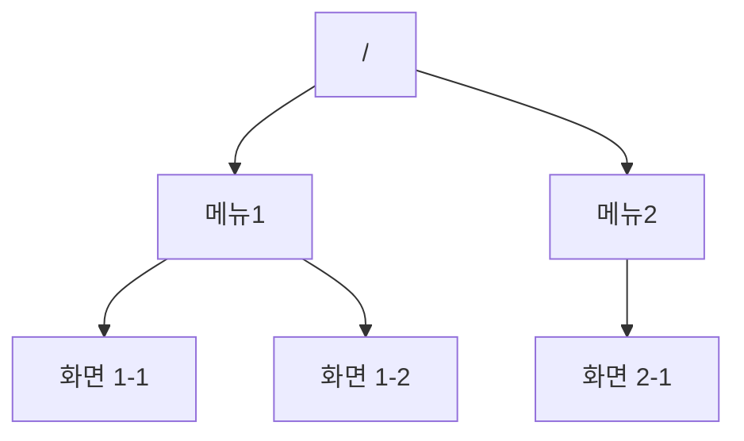
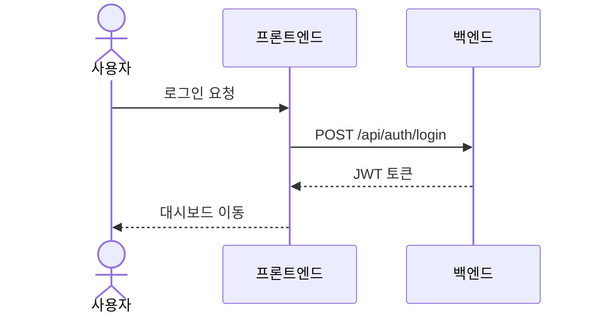

<!-- AUTO-GENERATED SKELETON — 이 파일은 /a2m_docs 질문 7b를 통해 내용을 채워넣으세요 -->

# 메뉴/화면 구성도 (SCREEN_MAP)

> 이 문서는 프로젝트의 정보 아키텍처(IA)를 기록합니다.
> PRD의 "핵심 기능"과 UI_GUIDE의 "컴포넌트 스펙" 사이를 잇는 문서로,
> 어떤 메뉴 아래 어떤 화면이 있고, 화면별 기능·권한·연결 API를 정의합니다.

---

## 사이트맵

> **TODO**: 실제 메뉴 구조로 대체하세요.

---

## 화면 목록

| 화면ID | 경로 | 상위 메뉴 | 권한(역할) | 주 사용자 |
|--------|------|-----------|-----------|-----------|
| SCR-001 | `/` | 루트 | 비로그인 포함 전체 | 방문자 |
| SCR-002 | `/dashboard` | 대시보드 | USER, ADMIN | 일반 사용자 |

> **TODO**: 실제 화면 목록으로 대체하세요.

---

## 화면 상세

### SCR-001: 홈 / 랜딩 페이지

- **목적**: 서비스 소개 및 진입점 제공
- **주요 기능**:
  - 사용자는 서비스 소개를 확인할 수 있다
  - 사용자는 로그인/회원가입으로 이동할 수 있다
- **사용 API**: (없음)
- **데이터 모델**: (없음)
- **상태/빈/에러 처리**: 로딩 없음. 정적 페이지.
- **권한별 노출 차이**: 로그인 상태면 대시보드로 리다이렉트

> **TODO**: 실제 화면 상세로 대체하세요.

---

## 주요 사용자 플로우

> **TODO**: 실제 핵심 End-to-end 시나리오로 대체하세요.
