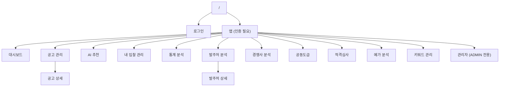
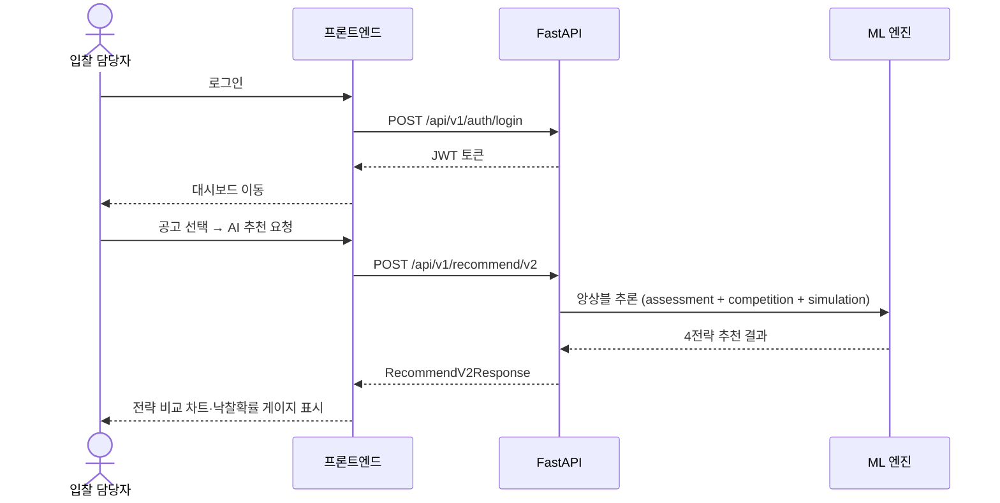

# 메뉴/화면 구성도 (SCREEN_MAP)

> 프로젝트의 정보 아키텍처(IA)를 기록합니다.
> 어떤 메뉴 아래 어떤 화면이 있고, 화면별 기능·권한·연결 API를 정의합니다.

---

## 사이트맵

---

## 화면 목록

| 화면ID | 경로 | 컴포넌트 파일 | 권한 | 주 사용자 |
|--------|------|-------------|------|----------|
| SCR-001 | `/login` | `LoginPage.tsx` | 비로그인 | 전체 |
| SCR-002 | `/dashboard` | `DashboardPage.tsx` | viewer, admin | 전체 |
| SCR-003 | `/bids` | `BidsPage.tsx` | viewer, admin | 전체 |
| SCR-004 | `/bids/:id` | `BidDetailPage.tsx` | viewer, admin | 전체 |
| SCR-005 | `/recommend` | `RecommendPage.tsx` | viewer, admin | 입찰 담당자 |
| SCR-006 | `/my-bids` | `MyBidsPage.tsx` | viewer, admin | 입찰 담당자 |
| SCR-007 | `/statistics` | `StatisticsPage.tsx` | viewer, admin | 분석 담당자 |
| SCR-008 | `/agencies` | `AgenciesPage.tsx` | viewer, admin | 분석 담당자 |
| SCR-009 | `/agencies/:id` | `AgencyDetailPage.tsx` | viewer, admin | 분석 담당자 |
| SCR-010 | `/competitors` | `CompetitorPage.tsx` | viewer, admin | 분석 담당자 |
| SCR-011 | `/joint-bid` | `JointBidPage.tsx` | viewer, admin | 입찰 담당자 |
| SCR-012 | `/qualification` | `QualificationPage.tsx` | viewer, admin | 입찰 담당자 |
| SCR-013 | `/yega` | `YegaPage.tsx` | viewer, admin | 입찰 담당자 |
| SCR-014 | `/keywords` | `KeywordsPage.tsx` | viewer, admin | 전체 |
| SCR-015 | `/admin` | `AdminPage.tsx` | admin | 관리자 |

---

## 화면 상세

### SCR-002: 대시보드

- **목적**: 전체 입찰 현황 KPI 및 트렌드 요약
- **주요 기능**:
  - KPI 카드: 총 공고 수, 경쟁사 수, 평균 낙찰률, 평균 경쟁사 수 (전월 대비 변화율 화살표)
  - 월별 트렌드 라인차트
  - 최근 공고 목록 (5건)
  - 사정율 트렌드 알림 카드 (급변 발주처×공종 상위 3건, ↑↓→ 방향 뱃지)
  - 이번 주 추천 공고 TOP5 (점수 바·등급 뱃지·개찰일·기초금액·BidDetailPage 링크)
- **사용 API**: `GET /api/v1/stats/overview`, `GET /api/v1/stats/top-srate-trends`, `GET /api/v1/bids/recommended`
- **권한**: viewer 이상

---

### SCR-003: 공고 관리

- **목적**: 나라장터 공고 목록 조회·필터링·북마크 관리
- **주요 기능**:
  - 캘린더형 보기 / 리스트 보기 전환
  - 필터: 상태, 발주처, 공종, 지역, 날짜, 키워드
  - 북마크 탭 (내 북마크만 보기)
  - 공고 클릭 → SCR-004 이동
- **사용 API**: `GET /api/v1/bids`, `POST/DELETE /api/v1/bids/{id}/bookmark`
- **권한**: viewer 이상

---

### SCR-005: AI 추천

- **목적**: 특정 공고에 대한 최적 투찰률 추천
- **주요 기능**:
  - 공고 조건 입력 (발주처, 공종, 지역, 기초금액, 경쟁사)
  - 4전략 추천 결과: 공격형·균형형·보수형·경쟁회피형
  - WinProbGauge (반원형 낙찰확률 게이지)
  - StrategyCompareChart (수평 바 차트)
  - SrateRangeViz (사정율 범위 슬라이더)
  - RiskCard (LOW/MEDIUM/HIGH)
  - 3-panel 사정율 비교: 발주처/공종/전체
  - 유사 사례 목록
  - A값·낙찰하한가 카드 (debounce 500ms, P10~P90 범위 바)
  - 사정율 트렌드 뱃지 (↑빨강/↓파랑/→회색, 발주처×공종 최근 3개월)
  - 프리즘 2.0 섹션 (BarChart 71구간 히트맵, TOP10 테이블, 주황 강조)
  - 전략 레포트 PDF 출력 버튼 (A4 5섹션: 공고 요약·A값·트렌드·4전략·리스크)
- **사용 API**: `POST /api/v1/recommend/v2`, `GET /api/v1/recommend/bid-range`, `GET /api/v1/stats/srate-trend`, `POST /api/v1/recommend/prism`
- **권한**: viewer 이상

---

### SCR-006: 내 입찰 관리

- **목적**: 자사 투찰 이력 관리 및 AI 추천 정확도 추적
- **주요 기능**:
  - 투찰 이력 등록·수정·삭제
  - 결과 탭: 진행중·낙찰·유찰 필터
  - 정확도 분석 탭: 산점도(실제 vs 추천 투찰률), MAE 월별 차트
  - 역산 분석 탭: rate_diff 분포 히스토그램 (중앙 0 기준선), 평균 격차 지표, 개인 편향 보정 요약 카드
- **사용 API**: `GET/POST/PATCH/DELETE /api/v1/my-bids`, `GET /api/v1/my-bids/analysis`, `GET /api/v1/my-bids/gap-analysis`
- **권한**: viewer 이상

---

### SCR-007: 통계 분석

- **목적**: 발주처·공종·사정율 분포 심층 분석
- **주요 기능**:
  - 탭: 발주처별 통계 | 공종별 통계 | 발주처×공종 히트맵 | 사정율 분포
  - 사정율 분포 탭: 히스토그램 BarChart + KPI 카드(평균·최빈·표준편차·표본수)
- **사용 API**: `GET /api/v1/stats/*`, `GET /api/v1/stats/srate-distribution`
- **권한**: viewer 이상

---

### SCR-010: 경쟁사 분석

- **목적**: 경쟁사 투찰 성향 및 패턴 분석
- **주요 기능**:
  - 경쟁사 목록 (승률·평균 투찰률·공격성 점수)
  - 투찰성향 탭: 5축 레이더 차트 (공격성·일관성·집중도·위험도·활동성)
  - 체크박스 2개사 비교 모드
  - 투찰구간 탭: BarChart 0.005 버킷 분포, 피크 구간 주황 강조, 회피 추천 뱃지, 90일/180일 토글
- **사용 API**: `GET /api/v1/competitors`, `GET /api/v1/competitors/{id}/pattern`, `GET /api/v1/competitors/compare`, `GET /api/v1/competitors/{id}/zones`
- **권한**: viewer 이상

---

### SCR-011: 공동도급

- **목적**: 공동도급 협정사 탐색 및 적격심사 AI 매칭
- **주요 기능**:
  - 공동도급 협정사 탐색 (업종·지역·규모 필터)
  - 공고 연계 AI 매칭 섹션: 공고 선택 후 "적격심사 AI 매칭" 버튼, 협정 가능 업체 목록 (적격 여부·최소 지분율·궁합점수)
- **사용 API**: `GET /api/v1/competitors`, `GET /api/v1/bids/{id}/joint-partners`
- **권한**: viewer 이상

---

### SCR-013: 예가 분석

- **목적**: Prism형 복수예가 빈도 분석으로 예가 산출 패턴 파악
- **주요 기능**:
  - 15개 후보 조합별 당첨 빈도 BarChart
  - 공고 조건 입력 시 해당 조건 기준 분석
  - 발주처 특화 패턴 섹션: 발주처 드롭다운 선택, TOP3 번호 하이라이트, dominant_zone 뱃지 (미선택 시 전체 분포)
- **사용 API**: `GET /api/v1/recommend/yega-frequency?agency_id=` (agency_id 선택 파라미터)
- **권한**: viewer 이상

---

## 주요 사용자 플로우

