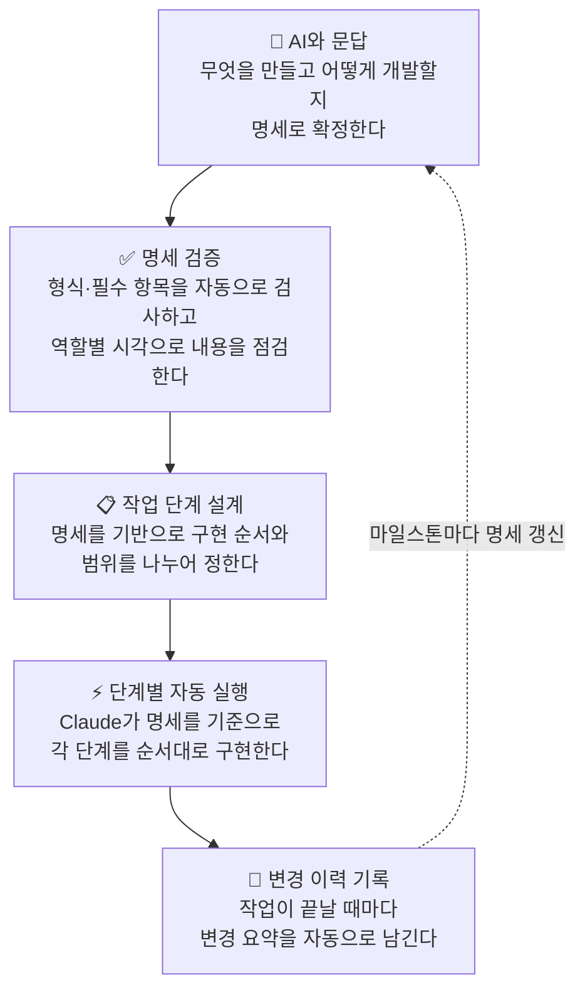

<p align="center" style="font-size: 3rem;">
  <strong>atom-harness-base</strong>
</p>

<p align="center"  style="font-size: 1.2rem;">
  에이전틱 코딩을 위한 명세·실행·검증 하네스<br/>
  <sub>Claude Code 위에 얹는 워크플로 레이어</sub>
</p>

<p align="center">
  <a href="https://www.python.org/downloads/"></a>
  <a href="https://docs.anthropic.com/en/docs/claude-code/overview"></a>
  <a href=".harness/docs/"></a>
</p>

---

<summary><strong>목차</strong></summary>

1. [이 프로젝트가 태어난 이유](#1-이-프로젝트가-태어난-이유)
2. [일반 Claude Code와의 차이](#2-일반-claude-code와의-차이)
3. [요구 사항](#3-요구-사항)
4. [빠른 시작](#4-빠른-시작)
5. [슬래시 명령 · 상황별 안내](#5-슬래시-명령--상황별-안내)
6. [문서를 문답으로 만든다](#6-문서를-문답으로-만든다)
7. [문서 작성 권고](#7-문서-작성-권고)
8. [문서 품질 검증](#8-문서-품질-검증)
9. [전문분야 페르소나](#9-전문분야-페르소나)
10. [하네스 스크립트](#10-하네스-스크립트)
11. [스택과 프로젝트 단계](#11-스택과-프로젝트-단계)
12. [문서 가이드](#12-문서-가이드)
13. [변경 이력](#13-변경-이력)
14. [MCP](#14-mcp)
15. [참고 프로젝트](#15-참고-프로젝트)
16. [디렉터리 구조](#16-디렉터리-구조)


---

## 1. 이 프로젝트가 태어난 이유

Claude Code 같은 AI 에이전트가 실제 개발 도구로 자리 잡으면서, 처음에는 채팅 몇 번으로 빠르게 뭔가 만들어 보는 **바이브코딩**에서 출발하는 팀이 많아졌습니다. 빠른 탐색과 프로토타이핑에는 더할 나위 없지만, 작업 규모가 커지고 에이전트에게 여러 단계를 연속으로 맡기는 **에이전틱 코딩**으로 전환하는 순간 다른 종류의 어려움이 생깁니다.

목표와 전제가 대화 안에만 남아 새 세션마다 다시 설명해야 하고, 스택·규칙 가정이 세션마다 조금씩 흔들리며, 코드는 계속 쌓이는데 "지금 기준이 무엇인지"를 파일로 갖고 있는 사람이 없는 상태가 됩니다. 에이전트에게 큰 작업을 넘길수록, 처음에 무엇을 어떻게 만들기로 했는지가 **레포 어딘가에 고정되어 있어야** 한다는 필요가 뚜렷해집니다.

**atom-harness-base는 그 필요에서 출발했습니다.** Claude Code를 대체하는 것이 아니라, 그 위에 얹을 수 있는 **명세·실행·검증 흐름**을 파일과 스크립트로 미리 잡아 둔 개발 하네스입니다. "무엇을 만들고, 어떤 제약 안에서 어떻게 만들지"를 `.harness/docs/`에 문서로 두고, 단계마다 그 문서를 가드레일로 조립해 에이전트에 주입합니다. 이 약속이 파일로 살아 있는 한, 에이전트는 세션이 바뀌어도 매번 같은 전제에서 출발합니다.

이 방식은 실무에서 흔히 **Spec-Driven**에 가깝게 불립니다. 차이가 있다면, 여기서는 명세가 긴 문서를 혼자 작성하는 것이 아니라 **AI와의 질문·답변으로 자연스럽게 채워지는** 흐름이라는 점입니다.

- **명세**: 제품 요구·설계 방향·코딩 규칙을 파일로 둡니다. 프로젝트 단계(prototype / mvp / production)마다 요구하는 충실도가 달라집니다.
- **실행**: 명세를 바탕으로 phase의 step마다 Claude를 호출하는 하네스 실행기가 있습니다. 중단 후 재개도 전제로 잡혀 있습니다.
- **가드레일 주입**: step 실행마다 루트 `CLAUDE.md`, 프로젝트 단계 정보, 지정 문서 전문이 프롬프트에 조립됩니다. 그 밖의 `.harness/docs` 파일은 제목·한 줄 요약 인덱스로 포함되고, step frontmatter에 `relevant_docs`를 적으면 해당 문서 전문이 추가로 붙습니다.


### ※ 한눈에 보는 흐름

<details>
<summary>다이어그램 보기</summary>



</details>

---


## 2. 일반 Claude Code와의 차이

위에서 말한 **대화만에 남는 약속**과 **레포에 고정된 약속**의 차이를 표로 정리하면 다음과 같습니다.

| 관점 | 보통 쓰는 방식 | 이 하네스 |
|------|----------------|-----------|
| 약속이 남는 곳 | 대화·메모 | 레포 안 문서 |
| 작업 단위 | 한 번에 크게 | 작은 단계로 나누어 순서대로 |
| 규칙·명세를 모델에 넣는 방식 | 세션마다 채팅에 붙여 넣기 | step 실행 시 가드레일 조립(CLAUDE.md + 주입 문서 + 인덱스 + `relevant_docs`) |
| 변경 이력 | 채팅 로그에 묻힘 | 작업 단위 요약 파일로 보관 |
| 문서 품질 확인 | 사람이 눈으로만 | 형식 검사(실행 전 프리플라이트 등) + 필요 시 `/a2m_check_docs`로 역할별 리뷰 |

---

## 3. 요구 사항

| 항목 | 버전 | 다운로드 |
|------|------|----------|
| Claude Code CLI | 최신 권장 | [docs.anthropic.com](https://docs.anthropic.com/en/docs/claude-code/overview) |
| Python | 3.9 이상 | [python.org](https://www.python.org/downloads/) |
| Git | 제한 없음 | [git-scm.com](https://git-scm.com/downloads) |

`claude`, `python`, `git` 세 명령이 터미널에서 실행 가능한 상태여야 합니다.

**Windows 추가 설정:** 한글·로그가 깨지지 않도록 UTF-8 출력 환경 변수를 설정합니다.

```powershell
$env:PYTHONIOENCODING = "utf-8"
[System.Environment]::SetEnvironmentVariable("PYTHONIOENCODING", "utf-8", "User")
```

macOS / Linux에서는 셸 설정 파일(`~/.zshrc` 또는 `~/.bashrc`)에 `export PYTHONIOENCODING=utf-8` 한 줄을 추가하면 됩니다.

---

## 4. 빠른 시작

**1단계 — 이 레포를 프로젝트에 복사합니다.**

대상 프로젝트 루트에 이 레포의 파일을 복사합니다.

**2단계 — Claude Code 전역 규칙 파일을 등록합니다.** (최초 1회)

```bash
# macOS / Linux
cp .global-rule/CLAUDE.md ~/.claude/CLAUDE.md
```

```powershell
# Windows (PowerShell)
Copy-Item .global-rule\CLAUDE.md "$env:USERPROFILE\.claude\CLAUDE.md"
```

**3단계 — Claude Code 채팅에서 슬래시 명령으로 시작합니다.**

처음이면 `/a2m_docs`로 명세를 채운 뒤 `/a2m_start`를 쓰는 순서가 무난합니다. 이미 코드가 있는 레포라면 `/a2m_start`만으로도 기존 코드를 분석해 명세와 단계를 설계하는 흐름으로 이어집니다.

---

## 5. 슬래시 명령 · 상황별 안내

명령 정의 파일은 `.claude/commands/` 폴더에 있습니다.

| 명령 | 언제 쓰나 |
|------|-----------|
| `/a2m_start` | 가장 흔한 진입점 — 새 작업 시작, 중단된 작업 재개 모두 |
| `/a2m_docs` | 문서를 처음 채우거나 전면 재작성할 때 |
| `/a2m_improve` | 기능 추가·수정 위주로 진행할 때 |
| `/a2m_check_docs` | 문서가 현재 단계 기준을 만족하는지 점검할 때 |
| `/a2m_review` | 코드를 체크리스트에 맞춰 검토할 때 |
| `/a2m_sync_docs` | 쌓인 변경 이력을 본문 문서에 한꺼번에 반영할 때 |
| `/a2m_mcp` | MCP 서버를 추가하거나 설정을 바꿀 때 |

**상황별 요약:** 새 프로젝트는 문서 → 시작 순서가 편합니다. 기존 레포에 하네스를 도입할 때는 `/a2m_start`가 코드를 먼저 읽고 안내합니다. 마일스톤 전에 문서만 정리하고 싶다면 `/a2m_sync_docs`를 쓰면 됩니다.

---

## 6. 문서를 문답으로 만든다

처음부터 긴 문서를 혼자 다 채울 필요는 없습니다. **AI가 질문하고 답을 이어 가면** 제품 정의·화면·보안·테스트 같은 항목이 자연스럽게 채워지는 흐름입니다. 사용 스택이 템플릿과 다를 때도, 같은 대화 흐름 안에서 규칙 파일과 설정을 맞추는 안내가 이어집니다.


---

## 7. 문서 작성 권고

명세 문서는 에이전트가 각 step마다 읽는 **유일한 지면**입니다. 초안이 흐릿하면 그 위에서 만들어지는 코드도 같이 흔들립니다. 문서를 만드는 단계에서 두 가지를 지키면 이후 개발 과정이 눈에 띄게 안정됩니다.

**초안을 바로 개발에 쓰지 마세요.** `/a2m_docs`로 초안을 만든 뒤 바로 `/a2m_start`로 넘어가고 싶은 충동이 생기지만, 첫 번째 결과는 대부분 뼈대 수준입니다. `/a2m_check_docs`로 **최소 두어 번 이상 검토·보완**하는 흐름을 강하게 권고합니다. 리뷰를 반복할수록 애매하게 넘어간 설계 결정과 빠진 제약 조건이 드러나고, 그것을 개발 전에 잡는 것이 나중에 뒤집는 것보다 훨씬 빠릅니다.

**문서 단계에서는 상위 모델을 아끼지 마세요.** LLM 모델의 성능 차이는 코드 생성보다 **문서의 깊이·일관성·누락 감지**에서 훨씬 크게 나타납니다. Claude Opus처럼 사고 능력이 높은 모델로 문서 초안과 검증을 돌리면, 놓치기 쉬운 설계 트레이드오프나 보안·운영 요구사항이 훨씬 촘촘하게 잡힙니다. 구현 단계에서는 빠른 모델로 내려가도 되지만, **명세를 세우는 단계만큼은 가장 좋은 모델을 쓰는 것**이 전체 결과 품질에 직결됩니다.

---

## 8. 문서 품질 검증

"파일은 있는데 내용이 비었다"를 방지하기 위해 **두 단계**로 나누어 볼 수 있습니다.

**1단계 — 형식·구조 검사.** 단계별로 필요한 문서·섹션, 템플릿 잔여, TODO 과다 등을 검사합니다. 하네스가 단계 실행을 시작할 때 **프리플라이트에서 한 번** 돌아가며, 오류가 있어도 사용자 확인으로 진행을 허용할 수 있습니다. 터미널에서만 돌릴 때는 [하네스 스크립트](#하네스-스크립트) 절에서 **문서 형식 검사**에 해당하는 스크립트를 보면 됩니다.

**2단계 — 내용 밀도 리뷰.** 1단계 오류가 없을 때, 보안·운영·개발 등 **역할을 나눈 페르소나**가 문서를 채점합니다. 점수·갭 목록·임계 통과 여부가 나오고, 레포만으로 채울 수 있는 항목과 결정이 필요한 항목을 구분합니다. `/a2m_check_docs`가 1단계 통과 후 2단계를 안내합니다. `production` 단계에서는 최근 캐시된 페르소나 결과를 실행 전에 **참고용으로만** 보여 줄 수 있으며, 이는 LLM을 매번 호출하는 것과는 다릅니다.

정리하면, **문답으로 초안을 만들고 → 형식 검사로 골격을 잡고 → 필요할 때 명령으로 역할별 리뷰를 돌려 내용을 보완하는** 흐름입니다. 스크립트 파일명·훅 연동은 [하네스 스크립트](#하네스-스크립트)에 따로 정리했습니다.

---

## 9. 전문분야 페르소나

역할별 리뷰(2단계)는 아래 페르소나들이 담당합니다. 각 페르소나는 자신의 전문 영역 문서만 평가하며, 현재 프로젝트 단계에 따라 참여 수준이 달라집니다.

### 페르소나 역할과 담당 문서

| 페르소나 | 담당 문서 | 주요 관점 |
|----------|-----------|-----------|
| 프로덕트 매니저 | PRD, SCREEN_MAP | 목표·페르소나·핵심 기능·성공 지표 |
| 소프트웨어 아키텍트 | ARCHITECTURE, ADR, PROJECT_STRUCTURE | 컴포넌트 경계·데이터 흐름·트레이드오프 결정 |
| 백엔드 리드 | CODING_CONVENTION, API_GUIDE, ARCHITECTURE | 에러 모델·트랜잭션·인증·동시성 정책 |
| 프론트엔드 리드 | UI_GUIDE, SCREEN_MAP, CODING_CONVENTION | 라우터 모델·상태 관리·공통 컴포넌트 스펙 |
| UX 디자이너 | UI_GUIDE, SCREEN_MAP | 사용자 플로우·디자인 원칙·접근성 |
| 보안 전문가 | SECURITY, API_GUIDE | 인증·권한·비밀 관리·OWASP |
| DBA / 데이터 엔지니어 | SCHEMA | 스키마·인덱스·마이그레이션·백업 전략 |
| QA 리드 | TESTING, API_GUIDE, SECURITY | 테스트 전략·커버리지·E2E 시나리오 |
| DevOps / SRE | DEPLOYMENT, PROJECT_STRUCTURE, MCP_GUIDE | 배포·환경·로깅·롤백 절차 |
| 테크니컬 라이터 | 전체 문서 | 용어 일관성·가독성·온보딩 |
| 도메인 전문가 | PRD, SCHEMA, SECURITY | 프로젝트 유형별 규정·업계 요구사항 |

### 단계별 페르소나 참여 수준

`●` 전체 리뷰 &nbsp;·&nbsp; `◐` 약식 리뷰 (핵심 항목만, 가중치 0.5×) &nbsp;·&nbsp; `○` 비활성

| 페르소나 | prototype | mvp | production |
|----------|:---------:|:---:|:----------:|
| 프로덕트 매니저 | ● | ● | ● |
| 소프트웨어 아키텍트 | ● ★ | ● ★ | ● ★ |
| 백엔드 리드 | ◐ | ● | ● |
| 프론트엔드 리드 | ◐ | ● | ● |
| UX 디자이너 | ○ | ● | ● |
| 보안 전문가 | ◐ | ● ★ | ● ★ |
| DBA / 데이터 엔지니어 | ○ | ● | ● ★ |
| QA 리드 | ○ | ◐ | ● |
| DevOps / SRE | ○ | ◐ | ● ★ |
| 테크니컬 라이터 | ◐ | ● | ● |
| 도메인 전문가 | ○ | ○ | ○ † |

> ★ **critical** 페르소나 — 해당 단계에서 점수 미달 시 리뷰 전체가 실패로 처리됩니다.  
> † 도메인 전문가는 `financial` / `healthcare` 등 특정 프로젝트 유형에서만 활성화됩니다.

※ 표는 `.harness/personas.yaml`의 **기본값**입니다. `profile.json`의 `project_type` 등에 따라 UX·보안 가중치·도메인 전문가 참여처럼 일부 페르소나의 단계 설정이 달라질 수 있습니다.

**통과 기준(기본값)**

| 단계 | 평균 점수 | critical 페르소나 최소 점수 |
|------|:---------:|:---------------------------:|
| prototype | 70점 | 50점 |
| mvp | 80점 | 60점 |
| production | 90점 | 70점 |

점수 기준은 `.harness/personas.yaml`의 `thresholds` 섹션에서 조정할 수 있습니다.

---

## 10. 하네스 스크립트

Claude Code의 `/a2m_*` 명령이 안내하는 일을 터미널에서 직접 하거나, 에디터 훅이 백그라운드에서 호출할 때 쓰는 Python 진입점입니다. 모두 **`.harness/scripts/`** 아래에 있습니다.

### 문서·실행·유틸

| 스크립트 | 역할 |
|----------|------|
| `validate_docs.py` | `.harness/docs`의 필수 문서·섹션, 템플릿 잔존, TODO 과다 등 **형식·구조 1차 검사** |
| `review_docs.py` | `personas.yaml` 기반 **페르소나 2차 검사**(1차 통과 후). 임계·캐시 처리 |
| `execute.py` | phase의 step 실행, 가드레일 조립, 프리플라이트, Claude 호출·완료 처리 |
| `ask_questions.py` | `questions.yaml` 기반 문답 진행(다음 질문·답변 반영·`profile.json` 연동) |
| `analyze_codebase.py` | 기존 레포를 스캔해 문서 초안을 채우는 분석(시작 흐름의 «기존 코드» 분기) |
| `find_resumable.py` | `.harness/phases`에서 재개 가능한 run 목록 안내 |
| `rebuild_index.py` | `phases/index.json`을 run 메타데이터에서 **재생성**(머지 충돌 복구 등) |
| `release_notes.py` | 실행 완료 후 `.harness/release-notes/` 요약·INDEX 갱신 |
| `references.py` | 참고 레포 URL 등록·목록 ([참고 프로젝트](#참고-프로젝트) 절 예시) |
| `run_checks.py` | Claude Code Stop 훅 — 감지된 스택의 lint·build·test, production 시 추가 검사 |
| `ci_gate.py` | production 단계용 CI 게이트 묶음 검사 |

### 에디터 훅(자동 호출)

`.claude/settings.json`에서 지정한 훅이 아래 스크립트를 호출합니다.

| 스크립트 | 역할 |
|----------|------|
| `guard_paths.py` | Edit/Write 시 보호 경로·민감 파일 경고 |
| `guard_bash.py` | Bash 도구 사용 전 위험 패턴 경고 |
| `guard_json.py` | 핵심 JSON/YAML(`profile.json`, `personas.yaml` 등) 파싱 검사 |

`test_execute.py`는 이 하네스 저장소 **자체**의 단위 테스트이며, 일반 프로젝트 작업에서는 사용하지 않습니다.

---

## 11. 스택과 프로젝트 단계

하네스가 각 step을 실행할 때는 루트 `CLAUDE.md`와 `profile.json`의 `context.always_inject_docs`에 지정한 문서 **전문**, 나머지 `.harness/docs`는 **인덱스**가 기본으로 붙고, step의 `relevant_docs`에 적은 문서만 추가로 **전문**이 붙습니다. 따라서 `CLAUDE.md`와 주입되는 문서에 적힌 스택·구조가 실제 폴더·빌드 도구와 다르면 모델이 잘못된 가정으로 코드를 만들기 쉽습니다. 스택이 바뀌었거나 템플릿과 다르면, 문서 작성이나 `/a2m_start` 흐름 안의 **맞추기 단계**를 먼저 밟아 두는 것이 좋습니다.

**프로젝트 단계**는 문서·테스트·보안에 기대하는 수준을 결정합니다. 빠른 실험(prototype), 첫 사용자 배포(mvp), 운영 서비스(production)처럼 구분하면 됩니다. 각 단계의 세부 기준은 레포 규칙 파일과 테스트·보안 문서에서 확인할 수 있습니다.

---

## 12. 문서 가이드

프로젝트 명세는 **`.harness/docs/`** 에 모아 둡니다. 대화형으로 점검하려면 `/a2m_check_docs`를 쓰고, 터미널에서만 형식 검사를 돌리려면 [하네스 스크립트](#하네스-스크립트) 절을 참고하면 됩니다.

| 분류 | 문서 | 내용 |
|------|------|------|
| 기획·구조 | [PRD.md](.harness/docs/PRD.md) | 무엇을 만들지 — 목표, 사용자, 핵심 기능 |
| | [ARCHITECTURE.md](.harness/docs/ARCHITECTURE.md) | 전체 구조와 데이터 흐름 |
| | [ADR.md](.harness/docs/ADR.md) | 주요 설계 결정과 그 이유 |
| 화면·코딩 | [UI_GUIDE.md](.harness/docs/UI_GUIDE.md) | UI 원칙과 컴포넌트 |
| | [SCREEN_MAP.md](.harness/docs/SCREEN_MAP.md) | 화면 목록과 내비게이션 구조 |
| | [CODING_CONVENTION.md](.harness/docs/CODING_CONVENTION.md) | 코딩 스타일과 커밋 규칙 |
| | [PROJECT_STRUCTURE.md](.harness/docs/PROJECT_STRUCTURE.md) | 폴더 구조, 빌드, 환경 변수 |
| 품질·배포 | [SECURITY.md](.harness/docs/SECURITY.md) | 인증, 비밀 관리, OWASP |
| | [TESTING.md](.harness/docs/TESTING.md) | 테스트 전략과 커버리지 기준 |
| | [API_GUIDE.md](.harness/docs/API_GUIDE.md) | REST 규칙과 엔드포인트 |
| | [SCHEMA.md](.harness/docs/SCHEMA.md) | DB 스키마와 마이그레이션 |
| | [DEPLOYMENT.md](.harness/docs/DEPLOYMENT.md) | 배포 절차와 런타임 환경 |
| 도구 연동 | [MCP_GUIDE.md](.harness/MCP_GUIDE.md) | MCP 서버 설정 및 환경 변수 |

채우지 않은 칸이나 TODO 표시가 많이 남아 있으면 실행 중 경고가 뜰 수 있으니, 중요한 작업 전에 `/a2m_check_docs`로 점검해 두세요.

---

## 13. 변경 이력

작업이 끝날 때마다 **짧은 요약**이 자동으로 쌓입니다. 커밋마다 긴 문서를 직접 수정하지 않아도 변경 내용을 기록할 수 있고, 나중에 본문 문서에 한꺼번에 반영하고 싶을 때 동기화 명령을 쓰면 됩니다.

---

## 14. MCP

`.mcp.json`에 Claude Code가 읽는 MCP 서버 목록이 들어 있습니다. 어떤 서버를 켤지, 환경 변수는 무엇인지는 [MCP 가이드](.harness/MCP_GUIDE.md)에 정리되어 있고, 대화형으로 설정을 바꾸고 싶다면 `/a2m_mcp`를 사용하면 됩니다.

---

## 15. 참고 프로젝트

다른 레포를 설계 참고용으로 등록해 둘 수 있습니다. 사용할 스크립트와 인수는 [하네스 스크립트](#하네스-스크립트) 절의 **문서·실행·유틸** 표를 보면 됩니다.

```bash
python .harness/scripts/references.py add https://github.com/example/project --purpose "API 구조 참고"
python .harness/scripts/references.py list
```

---

## 16. 디렉터리 구조

<details>
<summary>폴더 구조 보기</summary>

```
atom-harness-base/
├── .claude/           슬래시 명령, 에디터 훅
├── .global-rule/      Claude Code 전역에 한 번 복사하는 규칙 파일
├── .mcp.json          MCP 서버 목록
├── CLAUDE.md          이 레포에서 지킬 규칙 (실제 스택과 일치하게 유지)
└── .harness/
    ├── docs/          프로젝트 문서
    ├── phases/        단계별 작업 기록
    ├── release-notes/ 변경 요약
    └── scripts/       실행·검증·가드·유틸리티 스크립트
```

세부 파일 목록이 필요하면 저장소 트리를 직접 확인하세요.

</details>

---

<p align="center">
  문의는 팀 내부 채널을 이용해 주세요.<br/>
  <sub>atom-harness-base</sub>
</p>
